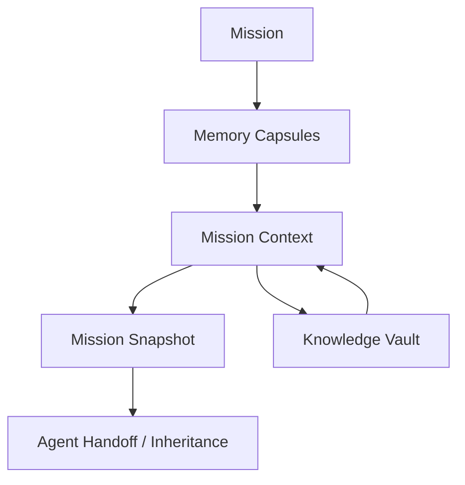

# Continuum

**Continuum is a durable mission-memory platform for autonomous agents — an agent-memory system that preserves a mission's operational knowledge across agent failure, replacement, and handoff.** Memory outlives any single agent and can be transferred to the next one.

When an autonomous agent fails or is replaced mid-mission, the context it was holding — what was observed, what was decided, what is still unsafe — is usually lost. Continuum turns that context into durable, attributable, queryable memory. Every observation, hazard, piece of reasoning, debate, decision, and lesson is committed as an **immutable Memory Capsule** in CockroachDB. From those capsules Continuum curates a current **Mission Context**, publishes **Mission Snapshots** for handoff, and promotes validated lessons into a governed **Knowledge Vault** — so a replacement agent can inherit exactly what its predecessor knew, without replaying the entire mission.

**ARES-7** — an autonomous Martian lava-tube survey in which the Navigation agent suffers a permanent processor failure and a replacement resumes safely by inheriting curated context — is the **demonstration scenario** used throughout this repository. It illustrates the platform rather than bounding it; the same continuity problem appears far beyond space (see [Beyond the Reference Scenario](#beyond-the-reference-scenario)).

## Project at a Glance

| Aspect             | Detail                                                                                                      |
| ------------------ | ----------------------------------------------------------------------------------------------------------- |
| **What it is**     | A durable agent-memory platform: Memory Capsules → Mission Context → Mission Snapshot → Knowledge Vault     |
| **Data tier**      | CockroachDB Serverless on **AWS** (`aws-eu-central-1`), SERIALIZABLE isolation                              |
| **Domain schema**  | 31 Prisma models and 19 enums in one SQL migration, all on CockroachDB                                      |
| **API**            | 20-endpoint NestJS REST API with generated OpenAPI/Swagger at `/docs`                                       |
| **Interfaces**     | Next.js "Mission Control" UI and a headless, REST-only simulator                                            |
| **Reference demo** | Deterministic 13-stage ARES-7 scenario, run end-to-end over the API                                         |
| **Memory model**   | Immutable capsules for 6 recorded artifact types — observation, reasoning, decision, debate, hazard, lesson |
| **Tests**          | 4 suites — Memory Engine unit, two API integration suites, and the simulator scenario                       |
| **Docs**           | 4 architecture documents in `docs/architecture`, with Mermaid diagrams                                      |
| **Workspace**      | pnpm + Turborepo monorepo — 8 packages (3 apps, 5 libraries)                                                |

---

## Why it Exists

Autonomous systems increasingly run as fleets of specialized agents that coordinate, disagree, and hand work off to one another. Those agents are not permanent: they crash, get suspended by policy, exhaust their budget, or get replaced by a newer version. In most systems, the moment an agent goes away, three things vanish with it:

- **What it observed** — the evidence it gathered and how confident it was.
- **Why it acted** — the reasoning, debate, and decisions behind its behavior.
- **What is still true and still dangerous** — open hazards and commitments a successor must honor.

The usual fallbacks are brittle: re-run everything from scratch, or hope the next agent re-derives the same conclusions from raw logs. Both are slow, and both risk repeating a mistake the mission already learned from.

**Continuum makes continuity a first-class capability.** It records mission knowledge as immutable, attributable capsules; curates a role-appropriate Mission Context from them; and produces snapshots designed for handoff. When an agent fails, its replacement is registered, assigned, and handed the inherited Mission Context — the mission continues from a known-good state instead of a blank slate. Continuum is the **system of record for a mission's cognitive continuity**; it does not replace the source systems that produce the underlying events.

---

## Beyond the Reference Scenario

ARES-7 is a spacecraft mission because that makes the stakes legible, but the problem Continuum addresses is not specific to space. The same continuity gap — operational knowledge lost when one agent hands off to another — appears wherever long-running, cooperating agents are replaced over time:

- **Production LLM agent systems** — where sessions, tools, and model versions change and prior reasoning is otherwise discarded.
- **Robotics** — where a unit is swapped or restarted and must resume a task already in progress.
- **Autonomous vehicles** — where control transfers between subsystems or fallback stacks.
- **Industrial automation** — where controllers and operators rotate across long-running processes.
- **Long-running workflow orchestration** — where steps outlive the worker that started them.
- **Incident response** — where responders hand off an active investigation and must inherit findings, decisions, and open risks.

In each of these settings, the cost of losing continuity is the same: a successor either stalls until it rebuilds context, or acts on an incomplete picture and repeats a mistake the system already paid for. Preserving _attributable, decision-grade_ memory across that boundary — not just logs to grep later — is what keeps a fleet of changing agents coherent and safe over time.

The memory model carries no ARES-7-specific logic: agents, capsules, context, snapshots, and the knowledge vault are domain-neutral. The ARES-7 seed and Mission Control UI are one concrete instantiation of that model — the reference scenario, not the boundary of where it applies. Continuum implements the continuity mechanism these domains need; it does not claim to be integrated with them today.

---

## Architecture Overview

Continuum's memory model is a pipeline. Raw mission activity enters as artifacts, becomes immutable memory, is curated into context, is frozen into snapshots at handoff points, and — for validated lessons — is promoted into reusable operational knowledge.



**Mission** — the unit of work and the consistency boundary. A mission owns its objectives, accountable authority, assigned agents, and terminal outcome. Nearly all writes are scoped to a single mission, which keeps transactions short and contention low.

**Memory Capsules** — the immutable, attributable core. Every meaningful mission artifact (an observation, a piece of reasoning, a decision, a debate, a hazard, or a lesson) is recorded as a Memory Capsule that references the artifact, its author agent, its importance, its confidence, and when it occurred. Capsules are never mutated; they form the chronological source history the rest of the system is built on.

**Mission Context** — the curated, versioned "what matters right now" view. The Memory Engine selects the most relevant capsules for a mission (prioritizing critical/high-importance items, active hazards, live objectives, unresolved decisions, and recent observations), ranks them, and persists a new **versioned** Mission Context with exactly one marked current. This is what an agent inherits.

**Mission Snapshot** — an immutable, published projection of the current Mission Context, generated at pause, handoff, or completion. A snapshot records which capsules were included and a completeness note, so a handoff has a stable, auditable artifact rather than a moving target.

**Knowledge Vault** — the governed home for reusable Operational Knowledge. A lesson learned on one mission is only useful later if it survives the mission. Validated lessons are promoted into the Knowledge Vault as active entries, and admitted knowledge can be curated back into future Mission Contexts.

The backend is organized as a **modular monolith** with domain-owned boundaries (Mission Management, Agent Workforce, Knowledge & Evidence, Deliberation & Decisions, Risk & Assurance, Memory Engine & Cognitive Continuity, Institutional Learning, Governance & Access). See [`docs/architecture`](docs/architecture) for the full context map, bounded contexts, and mission/agent lifecycle diagrams.

---

## Why This Isn't Just RAG

Continuum is a memory system, but not a retrieval-augmented-generation index. The difference is architectural:

- **Document retrieval (RAG)** answers "which text is most similar to this query?" It optimizes semantic recall over a corpus and treats its store as a searchable, replaceable cache.
- **Conversational memory** persists one agent's chat history so it can recall its own past turns — per-agent, and usually append-only text.
- **Continuum's durable operational memory** persists what the mission actually committed to — attributable observations, reasoning, decisions, debates, hazards, and lessons — as immutable, versioned records, and curates them into context that a **different** agent can inherit.

Four properties make it operational memory rather than a retrieval layer:

- **Immutability and attribution.** Each capsule is written once and carries its author agent, importance, confidence, and time. Nothing is silently overwritten, so the record can be trusted for safety-critical decisions.
- **Lineage.** Mission Context is versioned with a single current row, so you can see how the operative view of the mission changed over time — not just its latest state.
- **Snapshots.** A handoff produces an immutable, published projection with a completeness note: a stable artifact to hand a successor, not a live query that can shift underneath it.
- **Agent handoff.** The unit of value is _transfer between agents_ — a replacement inherits curated context and resumes, rather than re-deriving it. RAG and chat memory optimize recall for one consumer; Continuum optimizes continuity across a change of consumer.

Semantic retrieval is complementary, not the core. Vector Search over capsules is on the roadmap — the schema already carries an `embeddingReference` field — but it would be an index _on top of_ this durable operational record, not a replacement for it.

---

## Demo Flow

Pressing **Start Demo** in Mission Control (or running the headless simulator) executes the deterministic **ARES-7 lava-tube survey** scenario end to end against the public REST API. Every step below is a real API call that writes real rows to CockroachDB.

1. **Agent registration** — Navigation, Science, Power, and Communications agents are registered and assigned to the mission with role-appropriate authority.
2. **Observations** — each agent commits its initial findings (ingress route established, hydrated mineral deposit identified, systems healthy, relay confirmed) as Memory Capsules.
3. **Hazard** — Science detects fractured basalt beneath the western traverse and reports a **critical hazard** (collapse risk) owned by Navigation.
4. **Reasoning** — Science records structured reasoning: claim, conclusion, assumptions, alternatives, and uncertainty.
5. **Debate** — a debate is convened on whether to continue west, with Navigation supporting and Science opposing — dissent is preserved, not discarded.
6. **Debate resolution** — the debate is resolved in favor of safety, with the resolution authority recorded.
7. **Decision** — Navigation proposes and executes the decision to **reroute via the eastern shelf**, with rationale, scope, review trigger, and reversal conditions.
8. **Agent failure** — the Navigation agent suffers a **permanent processor failure** and is suspended.
9. **Replacement** — a replacement Navigation agent is registered and assigned.
10. **Inherited context** — the replacement retrieves the current **Mission Context** and resumes with the eastern-shelf decision and the open hazard already in hand — **no full replay required**.
11. **Lesson promotion** — the replacement records a lesson ("continuity handoffs must elevate terrain hazards and route decisions") which is **promoted into the Knowledge Vault** as Operational Knowledge.
12. **Mission snapshot** — a published Mission Snapshot is generated from the current context, and the hazard is resolved.
13. **Replay** — the Mission Timeline (the chronological capsule history) can be scrubbed in the UI to reconstruct the mission at any point, including the pre-replacement state.

**Why the handoff (steps 8–10) is the hard part.** When the Navigation agent fails, its replacement does not re-derive the terrain hazard or the reroute decision from raw logs — it **inherits** them as curated Mission Context and resumes from a known-good state. That transfer between agents, not recall for a single agent, is the capability Continuum is built around (see [Why This Isn't Just RAG](#why-this-isnt-just-rag)).

The web UI polls the **Mission Timeline**, **Mission Context**, and **Operational Knowledge** endpoints throughout, so capsules, context, and vault entries appear live as the scenario progresses.

---

## Why CockroachDB on AWS

Mission continuity is a **strong-consistency** problem: a decision, hazard, or handoff built on a stale or half-applied view is not merely wrong, it can be unsafe. Continuum therefore uses CockroachDB as its authoritative relational core, and every piece of durable state lives in **CockroachDB Serverless, running on AWS (`aws-eu-central-1`)**. Each capability below is used because the mission-memory problem needs it — not because it happened to be available.

- **AWS-hosted state, intentionally stateless app.** Mission state — every Memory Capsule, Mission Context version, and Mission Snapshot — is persisted only in CockroachDB Serverless on AWS, the single source of truth. The NestJS API and Next.js UI keep no durable state of their own; the one in-process structure (the per-mission serialization guard below) is a transient optimization, not a record. Because memory lives in the database and nowhere else, the application tier is disposable, horizontally replaceable, and **cloud-portable** — it runs anywhere that can reach the AWS-hosted cluster, while the mission's memory stays durably on AWS.
- **SERIALIZABLE isolation → context an agent can trust.** A replacement agent bets its safety on inherited Mission Context, so that context must never reflect a partially-applied write. CockroachDB's default SERIALIZABLE isolation makes context curation and snapshot publication behave as if no other transaction ran alongside them — the inherited state is always internally consistent, which is exactly the guarantee a safety-relevant handoff requires.
- **Immutable, versioned history → auditable memory.** Memory Capsules and Mission Snapshots are written once and never mutated, and Mission Context advances by version behind a single `isCurrent` row. That gives Continuum what an operational record needs and a cache does not: you can prove what was known, and when, at any point in the mission — not just read its latest state.
- **Retryable-conflict handling → handoffs that survive load.** Under SERIALIZABLE, concurrent transactions on the same rows can abort with a retryable `40001` conflict (Prisma `P2034`). The Memory Engine detects these and retries with bounded backoff, so a context build racing the operator UI's live polling resolves cleanly instead of failing mid-handoff. See `withSerializableRetry` in [`packages/memory-engine/src/memory-engine.service.ts`](packages/memory-engine/src/memory-engine.service.ts).
- **Mission-scoped serialization → contention removed at the source.** Context and snapshot builds for one mission touch the same current-context rows, and the UI polls context frequently. The Memory Engine orders those builds per mission id in-process, so overlapping writes are queued before they reach the database and there is rarely a conflict to abort. The SERIALIZABLE guarantee is unchanged; it simply isn't handed avoidable work. (Single API process today; the multi-instance path is in Future Work.)
- **Idempotent registration → a demo that is safe to repeat.** Agent registration upserts by unique handle and reuses an existing active assignment, and snapshot generation derives deterministically from the current context. A judge can press **Start Demo** repeatedly, and any client can retry a dropped request, without duplicating agents or corrupting mission state — continuity that survives retries is the entire point.
- **Optional Amazon S3 snapshot archival (additive AWS integration).** When `S3_BUCKET` and `AWS_REGION` are set, each generated Mission Snapshot is serialized to formatted JSON and uploaded via the AWS SDK v3 to `s3://$S3_BUCKET/mission/{missionId}/snapshots/{snapshotId}.json`; the object URI is stored on the snapshot's `archiveUri` column and the outcome on `archiveStatus` (`SKIPPED` when S3 is unconfigured, `UPLOADED` on success, `FAILED` on error). Archival is strictly best-effort: a failure is logged without rolling back CockroachDB or failing the request. Implemented in `apps/api/src/s3/*` with setup in [`docs/aws-s3-setup.md`](docs/aws-s3-setup.md); no change to the `POST /snapshots` contract.

Underneath, the schema (`prisma/schema.prisma`) is fully relational — 31 models with UUID primary keys and mission-scoped indexes — and writes are partitioned around mission identity, keeping transactions short and avoiding cross-mission contention on the normal path. CockroachDB is used deliberately, for the consistency a shared, safety-relevant memory actually requires; it does not reach for features the workload does not need.

---

## Repository Structure

Continuum is a pnpm + Turborepo monorepo. Everything the demo depends on is **implemented today** — the **NestJS API**, the **Memory Engine**, **Mission Control** (web), the **headless simulator**, the seed, and the **test suites**. Three workspace packages — `shared`, `agents`, and `prompts` — are **intentionally reserved roadmap placeholders**, labeled as such below; they are scaffolding for future work, not missing pieces of the current system.

```text
continuum/
├── apps/
│   ├── api/          NestJS REST API + Swagger (public boundary)
│   ├── web/          Next.js Mission Control operator UI
│   └── simulator/    Headless REST-only ARES-7 demo driver
├── packages/
│   ├── memory-engine/ Cognitive Continuity engine (Prisma-backed, framework-agnostic)
│   ├── config/        Shared TS / ESLint / Prettier config
│   ├── shared/        Reserved: shared types and utilities
│   ├── agents/        Reserved: agent abstractions (see Future Work)
│   └── prompts/       Reserved: prompt assets (see Future Work)
├── docs/
│   └── architecture/  System context, bounded contexts, lifecycles
├── prisma/
│   ├── schema.prisma  CockroachDB domain schema
│   ├── migrations/    SQL migrations
│   └── seed.ts        ARES-7 seed data
└── turbo.json         Turborepo pipeline
```

### Applications (`apps/`)

- **`apps/api`** — the **NestJS REST API** and public boundary. Exposes mission domain actions (agents, observations, hazards, reasoning, debates, decisions, lessons, objectives) and memory endpoints (capsules, context, snapshots, timeline, knowledge). Includes DTO validation (`class-validator`), CORS, and an auto-generated OpenAPI/Swagger document. Delegates all persistence to the Memory Engine and a Prisma-backed domain service.
- **`apps/web`** — **Mission Control**, the operator-facing Next.js (App Router) interface for the ARES-7 survey. Renders the agent fleet, mission map, timeline, context, hazards, and knowledge, and drives the end-to-end **Start Demo** scenario through the public REST API using React Query for live polling. It talks only to the API — it has no direct database access.
- **`apps/simulator`** — a **headless, REST-only demo driver** for the same ARES-7 scenario, with a console presentation logger. It is a pure API client (no Prisma, no database access), useful for running the full narrative from a terminal and for verifying the API independently of the UI.

### Packages (`packages/`)

- **`packages/memory-engine`** — the **framework-agnostic Cognitive Continuity engine**. Depends only on Prisma Client and returns typed `Result` values. Owns capsule recording, Mission Context curation, snapshot generation, timeline retrieval, per-agent context retrieval, operational-knowledge retrieval, and all CockroachDB SERIALIZABLE retry/serialization logic.
- **`packages/config`** — shared TypeScript, ESLint, and Prettier configuration consumed across the workspace.
- **`packages/shared`** — reserved workspace package for shared types and utilities.
- **`packages/agents`** — reserved workspace package for agent abstractions and orchestration (see Future Work).
- **`packages/prompts`** — reserved workspace package for prompt assets and management (see Future Work).

### Docs (`docs/`)

- **`docs/architecture`** — system context, bounded contexts, and mission/agent lifecycle documents (with Mermaid diagrams).
- **`docs/diagrams`**, **`docs/prd`**, **`docs/research`** — reserved for diagrams, product requirements, and research notes.

### Data (`prisma/`)

- **`prisma/schema.prisma`** — the full CockroachDB domain schema.
- **`prisma/migrations`** — SQL migrations.
- **`prisma/seed.ts`** — seeds the ARES-7 mission, agents, objectives, baseline observations/hazards, and an active Knowledge Vault.

---

## Features

Implemented today:

- **Immutable Memory Capsules** for six artifact types — observations, reasoning, decisions, debates, hazards, and lessons — each with author, importance, confidence, and occurrence time.
- **Mission Context curation** — relevance-ranked capsule selection, persisted as a versioned, single-current context per mission.
- **Mission Snapshot generation** — immutable, published, versioned snapshots derived from the current context, with capsule inclusion and a completeness note.
- **Knowledge Vault** — promotion of validated lessons into governed Operational Knowledge, and retrieval of active admitted knowledge.
- **Mission Timeline / Replay** — chronological capsule history for reconstructing mission state at any point.
- **Agent lifecycle** — idempotent registration, assignment, failure/suspension, and replacement **with Mission Context inheritance**.
- **Full mission domain actions** — observations, hazards (+ resolve), reasoning, debates (+ resolve), decisions (+ execute), lessons (+ promote), and objective updates, over a validated REST API.
- **CockroachDB SERIALIZABLE-aware persistence** — retryable-conflict handling plus per-mission serialization of context/snapshot builds.
- **Mission Control UI** — live-polling operator interface with an end-to-end ARES-7 demo and a replay slider.
- **Headless simulator** — the same scenario as a REST-only terminal client.
- **Seed + test suites** — reproducible ARES-7 data and unit/integration tests across the Memory Engine, API, and simulator.

---

## Screenshots & Demo

A walkthrough recording and screenshots accompany the Devpost submission. Because the demo is fully runnable (see [Quick Start](#quick-start)), each surface can also be reproduced locally in minutes:

- **Mission Control** at the agent-failure → replacement handoff — open `http://localhost:3000` and press **Start Demo**.
- **Swagger / OpenAPI** — `http://localhost:3001/docs`.
- **CockroachDB rows** — watch the mission, agents, and Memory Capsules appear in the CockroachDB SQL console as the demo writes them.
- **Headless simulator** — the narrated timeline printed by `pnpm --filter @continuum/simulator demo`.

<!-- Embed captures here before submission: docs/diagrams/screenshot-*.png -->

---

## Quick Start

### Prerequisites

- **Node.js ≥ 22** and **pnpm ≥ 10** (the repo pins pnpm via Corepack).
- A **CockroachDB** database — CockroachDB Cloud (Serverless) or a local cluster.

### 1. Install

```bash
corepack enable
pnpm install
```

### 2. Configure the database

Create a root `.env` with your CockroachDB connection string (see `.env.example`):

```bash
# .env
DATABASE_URL="postgresql://<user>:<password>@<host>:26257/continuum?sslmode=verify-full"
```

### 3. Generate the client, migrate, and seed

```bash
pnpm db:generate
pnpm db:migrate
pnpm db:seed        # seeds the ARES-7 mission, agents, objectives, and Knowledge Vault
```

`pnpm db:seed` prints the seeded mission's UUID and the exact environment lines to copy:

```text
Mission ID: <ARES-7 mission UUID>

Set this in your environment to run the demo:
  apps/web/.env.local  ->  NEXT_PUBLIC_MISSION_ID=<ARES-7 mission UUID>
  simulator            ->  MISSION_ID=<ARES-7 mission UUID>
```

Copy that `NEXT_PUBLIC_MISSION_ID` value for the next step. (There is no mission-lookup endpoint yet, so the seed is the source of the id.)

### 4. Run the API (port 3001)

```bash
pnpm --filter @continuum/api build
node --env-file=.env apps/api/dist/main.js
```

The API listens on `http://localhost:3001` (override with `PORT`).

### 5. Run Mission Control (port 3000)

Create `apps/web/.env.local` (see `apps/web/.env.example`):

```bash
NEXT_PUBLIC_API_URL=http://localhost:3001
NEXT_PUBLIC_MISSION_ID=<the ARES-7 mission UUID from step 3>
```

Then start the web app:

```bash
pnpm --filter @continuum/web dev
```

Open `http://localhost:3000` and press **Start Demo**.

---

## Running Tests

The workspace includes unit and API integration test suites (Memory Engine, API, and simulator).

```bash
# all packages
pnpm test

# a single package
pnpm --filter @continuum/memory-engine test
pnpm --filter @continuum/api test
pnpm --filter @continuum/simulator test
```

Static checks:

```bash
pnpm typecheck
pnpm lint
```

---

## Running the Simulator

The simulator drives the full ARES-7 scenario over REST — no database access — and prints a narrated timeline and summary. Start the API first, then:

```bash
MISSION_ID=<ARES-7 mission UUID> \
API_BASE_URL=http://localhost:3001 \
pnpm --filter @continuum/simulator demo
```

Configuration (see `apps/simulator/.env.example`):

- `MISSION_ID` — UUID of the seeded ARES-7 mission (required).
- `API_BASE_URL` — API base URL (defaults to `http://localhost:3001`).
- `SIMULATOR_RUN_ID` — namespaces generated agent handles so runs stay deterministic and repeatable.

---

## API

The public REST API is a NestJS service of **20 endpoints** across three controllers, all namespaced under `/missions/:missionId`. Full request/response schemas are generated as OpenAPI and served at **`http://localhost:3001/docs`** (Swagger UI), where every endpoint can be exercised directly.

**Agents** (`…/agents`)

- `POST /agents` — register an agent and active assignment (idempotent)
- `POST /agents/:agentId/fail` — suspend a failed agent
- `POST /agents/:agentId/replace` — register a replacement and return its inherited context
- `GET /agents/:agentId/context` — the Mission Context an assigned agent inherits

**Memory**

- `POST /memory/capsules` — record a Memory Capsule
- `GET /context` — build and return the current Mission Context
- `POST /snapshots` — publish a Mission Snapshot from the current context
- `GET /timeline` — chronological capsule history (Mission Replay)
- `GET /knowledge` — active Operational Knowledge from the Vault

**Mission actions**

- `POST /observations`
- `POST /hazards` · `PATCH /hazards/:hazardId/resolve`
- `POST /reasoning`
- `POST /debates` · `POST /debates/:debateId/resolve`
- `POST /decisions` · `POST /decisions/:decisionId/execute`
- `POST /lessons` · `POST /lessons/:lessonId/promote`
- `PATCH /objectives/:objectiveId`

---

## Tech Stack

- **Language:** TypeScript
- **Monorepo:** pnpm workspaces + Turborepo
- **API:** NestJS 11 (Express), `class-validator`, `@nestjs/swagger`
- **Frontend:** Next.js (App Router), React, TanStack Query, Tailwind CSS, Framer Motion
- **Database:** CockroachDB Serverless on AWS (SERIALIZABLE isolation)
- **AWS (optional):** Amazon S3 Mission-Snapshot archival via `@aws-sdk/client-s3` (v3)
- **ORM:** Prisma
- **Tooling:** ESLint, Prettier, Husky, lint-staged, Vitest, GitHub Actions

---

## Future Work

Genuinely planned, not yet implemented:

- **Vector Search over Memory Capsules.** The schema already carries an `embeddingReference` field on capsules; the semantic-retrieval projection that would populate and query it is not built yet.
- **Agent abstractions (`packages/agents`).** A reusable agent/orchestration layer so autonomous agents can consume Continuum's memory and context programmatically. The package is currently a reserved placeholder.
- **Prompt assets (`packages/prompts`).** Prompt management for LLM-driven agents built on top of Continuum. Reserved placeholder today.
- **Governance & access enforcement.** Classification and authorization are modeled in the domain; runtime policy enforcement at action and handoff time is a planned addition.
- **Multi-instance deployment.** The current per-mission serialization is in-process (single API instance). Horizontal scale-out would move that coordination to a database-level advisory lock.
- **Mission overview / map data endpoints.** Some Mission Control panels use static presentation data where the API does not yet expose overview or map projections.

---

## License

This project is licensed under the [MIT License](LICENSE).
