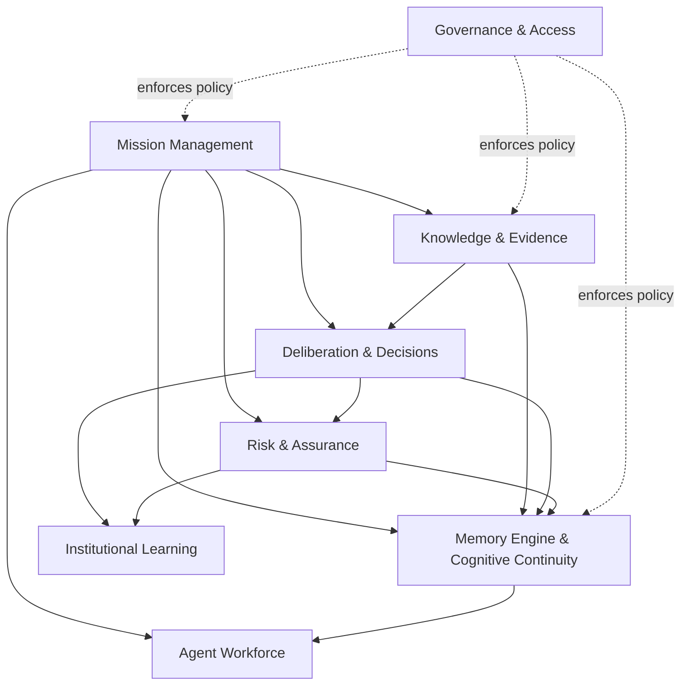

# Backend Bounded Contexts

## Recommendation

Use a modular NestJS backend with boundaries defined by domain ownership, not by infrastructure or screens. Begin with a modular monolith so cross-context invariants can remain transactional; preserve explicit domain events and contracts so high-volume or independently scaled contexts can later be extracted.

## Context map

## Context responsibilities

### Mission Management

Owns mission identity, lifecycle, scope, accountable authority, objectives, and mission-level terminal outcomes. It exists because mission state must remain coherent even as evidence, agents, and policies evolve. It publishes mission lifecycle changes and consumes assessed progress, hazards, and decisions without owning their internal details.

### Agent Workforce

Owns agent registration, capabilities, assignment, role, availability, and delegated authority. It exists to prevent agent lifecycle and permissions from becoming incidental fields on mission work. It consumes mission availability and continuity handoffs, and publishes assignment changes.

### Knowledge & Evidence

Owns observations, provenance, evidence validation, source references, and reasoning artifacts. It exists to protect the distinction between what was observed and what was inferred. It publishes validated or disputed knowledge changes for deliberation and continuity.

### Deliberation & Decisions

Owns debates, positions, decision proposals, approvals, decision lifecycle, and rationale. It exists because disagreement and commitment have different rules than evidence collection. It consumes evidence and authority assertions, and publishes decisions and debate resolutions.

### Risk & Assurance

Owns hazards, assessment, mitigation tracking, acceptance, escalation, and assurance review. It exists because safety and integrity need an explicit lifecycle and cannot be inferred only from task status. It consumes observations and decisions and publishes material risk changes.

### Memory Engine & Cognitive Continuity

Owns immutable Memory Capsules, Mission Context curation, snapshot generation, Vector Search indexing, Mission Replay read models, inheritance policy application, handoff acknowledgement, and recovery views. It exists to make continuity a first-class capability rather than an incidental query across tables. It consumes published artifacts from the other contexts, creates capsules that reference them, and does not change their source histories or business lifecycles.

### Institutional Learning

Owns lesson candidates, validation, Knowledge Vault admission, applicability, review, supersession, and retirement. It exists to separate reusable Operational Knowledge from mission-local notes. It consumes completed or material mission outcomes and publishes Knowledge Vault entries eligible for Mission Context curation.

### Governance & Access

Owns policy evaluation, classification, retention, audit requirements, and authorization integration. It exists to make information handling and authority consistently enforceable across every context. It should expose policy decisions and audit contracts, not become a duplicate owner of each business artifact.

## Interaction rules

- Contexts communicate through explicit commands and published domain events; no context reaches into another context's internal model.
- Mission Management is the reference for mission lifecycle and objective authority.
- Knowledge & Evidence is the reference for provenance and artifact validity.
- Deliberation & Decisions is the reference for decision status and debate outcomes.
- Memory Engine & Cognitive Continuity creates immutable capsules and projections from published state; Mission Context, snapshots, Vector Search, and Mission Replay are capsule-derived. It is never the source of a decision or observation.
- Governance is consulted at sensitive actions, but domain contexts record the resulting authorized action for audit.

## NestJS and CockroachDB guidance

Keep each context behind an application-facing facade, domain layer, and infrastructure adapter. Transaction boundaries should normally be mission-scoped and short. Use an outbox-style event publication approach so committed state changes and downstream capsule creation, continuity, or learning work cannot diverge. Make consumers idempotent and version-aware because distributed retries and asynchronous processing are normal. Do not split into networked services until independent deployment or scaling needs outweigh the cost of distributed consistency.
