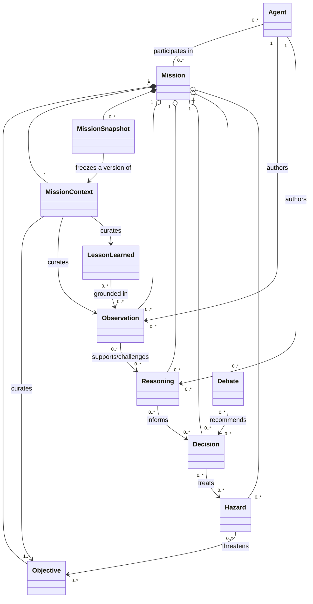

# Continuum Domain Model

## Purpose and scope

Continuum coordinates autonomous missions while preserving the evidence, reasoning, decisions, and lessons that make later work more informed. This document defines the business language and behavioral boundaries of the domain; it deliberately does not prescribe storage structures, APIs, or framework modules.

The model distinguishes **facts and evidence** from **interpretations**, **commitments**, and **durable knowledge**. That separation keeps an audit trail intact and lets new agents challenge earlier conclusions without rewriting history.

## Domain principles

1. A mission is the primary unit of accountable work.
2. Observations are attributable evidence; reasoning is an interpretation of evidence.
3. Decisions are explicit commitments with accountable authority and rationale.
4. Agents are mission participants, not owners of institutional memory.
5. Mission context is a curated working set; snapshots are immutable continuity handoffs.
6. Lessons learned are validated, reusable knowledge—not merely past output.
7. Hazards are managed explicitly, including uncertainty and information hazards.

## Ubiquitous language

| Term                    | Meaning                                                                                         |
| ----------------------- | ----------------------------------------------------------------------------------------------- |
| Mission                 | A bounded, accountable effort to advance one or more objectives under defined constraints.      |
| Evidence                | Source material represented as an observation, with provenance and confidence.                  |
| Working context         | The current, bounded body of information made available to mission participants.                |
| Snapshot                | An immutable point-in-time continuity artifact describing a mission's state and usable context. |
| Institutional knowledge | Lessons and resolved debate outcomes approved for reuse beyond their originating mission.       |

## Entity model

### Mission

- **Purpose:** The accountable container for a piece of autonomous work.
- **Responsibilities:** Defines intent, scope, authority, participants, constraints, lifecycle state, and the current mission context. It accepts objectives, coordinates work, and records terminal outcomes.
- **Lifecycle:** Draft → planned → active → paused or completing → completed, cancelled, or failed. A completed mission remains readable and may contribute lessons, but cannot accept new operational decisions.
- **Relationships:** Owns objectives, mission context, snapshots, observations, reasoning, decisions, debates, and hazards. Has many participating agents and may reference reusable lessons.
- **Invariants:** A mission has a single accountable sponsor or owner; it has at least one objective before activation; only one current mission context exists; terminal missions are immutable except for post-mission review metadata; every consequential decision belongs to exactly one mission.

### Agent

- **Purpose:** A human-supervised or autonomous actor that performs bounded mission work.
- **Responsibilities:** Accepts an assigned role and authority, consumes inherited context, creates attributable observations and reasoning, declares uncertainty, and hands work back through snapshots.
- **Lifecycle:** Registered → eligible → assigned → active → suspended or released → retired. Assignment is scoped to a mission and can be revoked independently of the agent's broader status.
- **Relationships:** Participates in missions; authors observations, reasoning, proposals, debate contributions, and lessons. It may be the subject of performance or capability observations, but never owns a mission's memory.
- **Invariants:** An agent acts only within an active assignment and granted authority; all artifacts identify their producing agent or an explicitly declared system process; an agent cannot approve its own proposal where separation of duties is required; inherited context is read-only unless the agent creates a new attributed artifact.

### Observation

- **Purpose:** An atomic, attributable statement about the world, a source, or mission execution.
- **Responsibilities:** Preserves provenance, capture time, scope, confidence, classification, and whether it is direct evidence or an agent report. It does not silently assert a conclusion.
- **Lifecycle:** Captured → validated, superseded, disputed, or withdrawn. Withdrawal preserves the artifact and explains why it is no longer reliable.
- **Relationships:** Belongs to a mission; may support or challenge reasoning, decisions, hazards, objectives, and lessons; can be introduced in a debate; is included or omitted by a mission context through curation.
- **Invariants:** Provenance and capture time are immutable; confidence is explicit rather than implied; an observation cannot be edited into a different claim; supersession and dispute links preserve the original; sensitive observations carry handling constraints.

### Reasoning

- **Purpose:** A transparent interpretation that connects observations, assumptions, and a conclusion or recommendation.
- **Responsibilities:** States claims, alternatives considered, assumptions, uncertainty, supporting and contradicting evidence, and the producing agent's confidence.
- **Lifecycle:** Draft → submitted → challenged, accepted, superseded, or rejected. Multiple reasoning artifacts can coexist; acceptance does not make one universally true.
- **Relationships:** Belongs to a mission and is authored by an agent; cites observations and lessons; informs decisions and debate positions; may identify hazards or propose objective changes.
- **Invariants:** Reasoning must distinguish observation from inference; material claims link to evidence or explicitly labelled assumptions; conclusions retain their provenance when cited by a decision; rejection records rationale rather than deletion.

### Decision

- **Purpose:** An authoritative commitment to a course of action, policy, or mission change.
- **Responsibilities:** Captures the chosen option, decision authority, rationale, evidence and reasoning considered, effective scope, review trigger, and reversal conditions.
- **Lifecycle:** Proposed → under review → decided → executed, revised, superseded, or revoked. Decision records remain immutable after enactment; later changes are new decisions linked to their predecessors.
- **Relationships:** Belongs to a mission; is proposed or approved by agents with authority; addresses objectives and hazards; is supported by reasoning and observations; can close a debate and produce lessons.
- **Invariants:** Only an authorized actor may decide; a decided record identifies its authority and rationale; execution cannot precede an effective decision; high-impact decisions require a review path; a superseding decision never erases the prior one.

### Debate

- **Purpose:** A structured process for resolving material disagreement, uncertainty, or competing approaches.
- **Responsibilities:** Defines the question, participants, admissible evidence, positions, challenge process, resolution authority, and whether the outcome should become institutional knowledge.
- **Lifecycle:** Convened → active → evidence review → resolved, deferred, or abandoned. A resolved debate may be reopened only as a new debate linked to the prior result.
- **Relationships:** Belongs to a mission; contains agent positions and references observations and reasoning; may lead to decisions, hazards, and lessons learned; is summarized in snapshots.
- **Invariants:** The question is explicit; contributions are attributable; dissent is retained in the record; resolution has an identified authority or documented lack of resolution; a debate does not itself enact a decision.

### Hazard

- **Purpose:** A condition, uncertainty, or event that could harm mission safety, integrity, legality, cost, or objective achievement.
- **Responsibilities:** States impact, likelihood or uncertainty, indicators, mitigations, owner, escalation requirements, and current status.
- **Lifecycle:** Identified → assessed → mitigated, accepted, transferred, escalated, realized, or closed. Realization creates a traceable operational event without deleting the hazard record.
- **Relationships:** Belongs to a mission; may arise from observations, reasoning, or debates; threatens objectives; is treated by decisions; informs context and snapshots; may produce lessons.
- **Invariants:** Every open material hazard has an owner and review cadence; acceptance is an explicit authorized decision; closure has supporting evidence; a hazard cannot be silently downgraded without rationale; handling restrictions apply to sensitive hazards.

### Objective

- **Purpose:** A measurable or assessable outcome that gives a mission direction.
- **Responsibilities:** Defines desired outcome, success criteria, priority, constraints, dependencies, and current progress assessment.
- **Lifecycle:** Proposed → approved → active → achieved, revised, deprioritized, or abandoned. Revision creates a traceable new version of intent.
- **Relationships:** Belongs to a mission; may be decomposed into child objectives; is advanced by decisions and informed by observations; is threatened by hazards; is reflected in snapshots and reviews.
- **Invariants:** An active mission has one or more active objectives; objective success criteria are defined before work is evaluated; parent-child objectives cannot form cycles; material revision requires an authorized decision; progress claims cite evidence.

### Lesson Learned

- **Purpose:** A validated, reusable statement of knowledge derived from mission experience.
- **Responsibilities:** Captures the lesson, applicability conditions, supporting evidence, confidence, limitations, review date, and adoption status. It prevents local experience from being lost after a mission closes.
- **Lifecycle:** Candidate → reviewed → approved for mission use or institutional use → superseded, retired, or reaffirmed. Candidates are not inherited by default outside their origin mission.
- **Relationships:** Is derived from one or more decisions, debates, observations, hazards, or outcomes; may be referenced by future reasoning and mission contexts; is promoted into institutional knowledge after approval.
- **Invariants:** A lesson identifies its supporting source artifacts and applicability boundary; institutional lessons have an accountable steward and review cycle; lessons retain counterexamples and limitations where known; supersession preserves the prior lesson.

### Mission Context

- **Purpose:** The curated, current working knowledge available to agents for a mission.
- **Responsibilities:** Selects and prioritizes objectives, active decisions, evidence, assumptions, open debates, hazards, relevant lessons, operational constraints, and references to detailed artifacts. It controls information relevance and access.
- **Lifecycle:** Initialized during planning → continuously curated while active → frozen as part of a terminal snapshot. Context is versioned whenever its semantic content changes materially.
- **Relationships:** Belongs to one mission; references all other domain entities without owning their histories; is the primary source from which agents inherit mission knowledge; produces snapshots.
- **Invariants:** Exactly one current context version is designated per active mission; context references preserve access classification; curation never changes the source artifact; included summaries link to source artifacts; context size is bounded by relevance policy rather than unrestricted accumulation.

### Mission Snapshot

- **Purpose:** An immutable continuity handoff that permits safe resumption, review, transfer, or audit.
- **Responsibilities:** Captures mission state, objective progress, active decisions, open hazards, unresolved questions, relevant evidence and reasoning, debate status, next actions, and a digest of the mission context at a point in time.
- **Lifecycle:** Requested → generated → validated → published → superseded or archived. Published snapshots are immutable and remain readable according to classification policy.
- **Relationships:** Belongs to a mission; is generated from a version of mission context; is consumed by agents during assignment or resumption; references source artifacts and can seed a successor mission's context.
- **Invariants:** A snapshot identifies its source context version and generation reason; it does not duplicate authority by becoming a new decision; it contains a completeness assessment and unresolved items; an agent inherits only material permitted by its assignment and classification.

## High-level domain diagram

## Cognitive Continuity

Cognitive Continuity is Continuum's ability to preserve a mission's usable understanding across agent changes, pauses, failures, and mission boundaries. It is not raw transcript retention. It is the governed transfer of evidence, interpretations, commitments, uncertainties, and next actions with enough provenance for a new agent to orient, verify, and continue safely.

### Agent context inheritance

When an agent is assigned or resumes work, it receives a role- and classification-filtered view of the latest validated mission snapshot plus the current mission context. The receiving agent must acknowledge the assignment, inspect open hazards and active decisions, and may request source artifacts before acting. Inheritance gives the agent knowledge to work from; it does not transfer decision authority or erase the agent's obligation to assess evidence.

### Information transferred

- Mission intent, scope, authority boundaries, and active objectives.
- Current decisions, their rationale, effective conditions, and reversal triggers.
- Priority observations with provenance, confidence, and disputes.
- Active reasoning, assumptions, alternatives, and unresolved questions.
- Debate state, minority positions, and resolution status.
- Open hazards, mitigations, escalation paths, and safety constraints.
- Relevant approved lessons, including their applicability limits.
- Explicit next actions, owners, dependencies, and snapshot completeness warnings.

### Snapshot and memory policy

Snapshots are generated at mission activation, agent handoff, material decision, material hazard change, debate resolution, pause/resume, before terminal transition, and periodically for long-running missions. They may also be requested for audit or recovery. Generation is event-driven and can be supplemented by a time-based policy; it must never block urgent safety escalation.

Mission context is updated when validated evidence arrives, a decision changes effective state, an objective changes, a hazard changes materially, a debate reaches a material stage, or a curator explicitly changes relevance. Updates are append-oriented and versioned so historical context remains reconstructible.

### From debate to institutional knowledge

A resolved debate does not automatically become institutional knowledge. Its resolution may nominate a lesson candidate. A review assesses evidence quality, repeatability, applicability, counterexamples, and stewardship. Once approved for institutional use, the lesson is indexed for future contexts, carries a review date, and retains both the debate summary and dissent. New evidence can supersede the lesson without altering its origin record.
