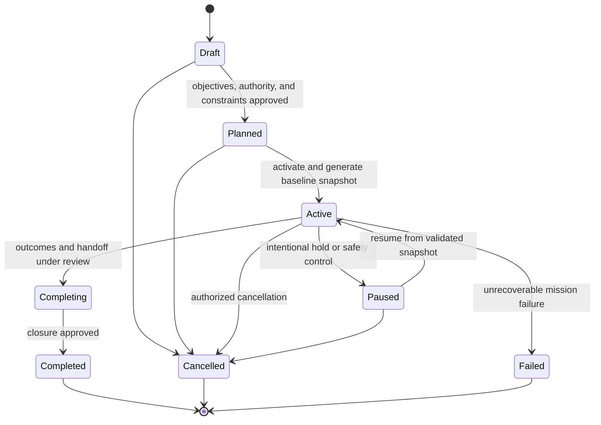
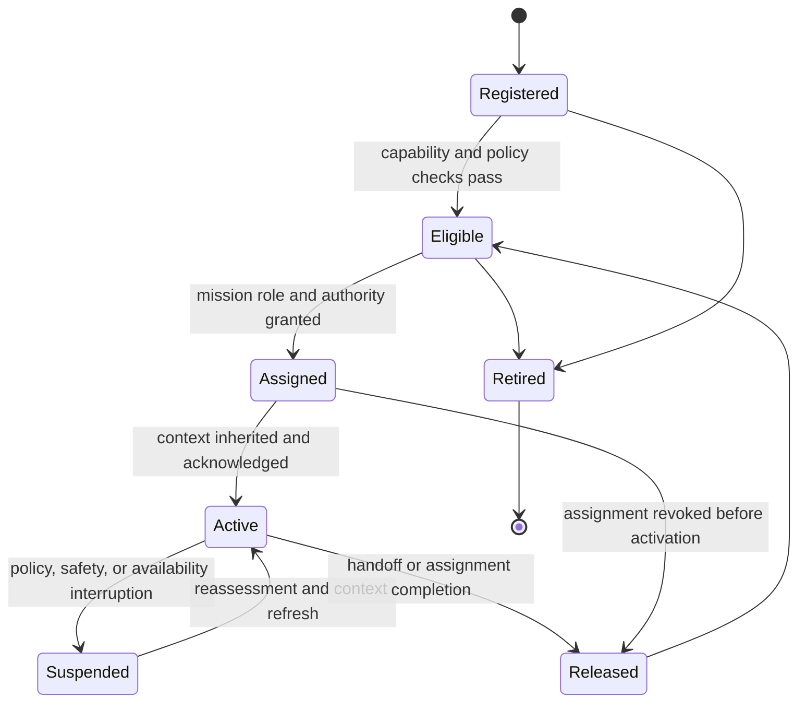
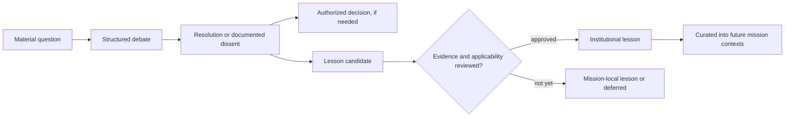

# Mission and Agent Lifecycles

## Mission lifecycle

| State      | Meaning                                                         | Entry requirements                                                    | Exit requirements                                                     |
| ---------- | --------------------------------------------------------------- | --------------------------------------------------------------------- | --------------------------------------------------------------------- |
| Draft      | Intent is being shaped and is not actionable.                   | Mission sponsor exists.                                               | Scope, authority, constraints, and initial objectives are reviewable. |
| Planned    | Work is authorized in principle but not yet executing.          | Objectives and ownership are approved.                                | Eligible agents, safety controls, and baseline context are ready.     |
| Active     | The mission may accept work and decisions.                      | Baseline snapshot is published and assignments are valid.             | Terminal, pause, or completion transition is authorized.              |
| Paused     | Work is temporarily stopped while knowledge is preserved.       | A pause reason and current snapshot exist.                            | Resume authority confirms context remains usable.                     |
| Completing | Work has ceased; outcomes, hazards, and lessons are reconciled. | Proposed outcome and handoff are available.                           | Closure review completes and unresolved obligations are assigned.     |
| Completed  | Objectives are assessed and the mission is closed normally.     | Final snapshot and outcome record exist.                              | None; only review metadata may be appended.                           |
| Cancelled  | Mission is ended by authority without normal completion.        | Cancellation rationale and continuity handoff exist.                  | None.                                                                 |
| Failed     | Mission cannot continue within accepted constraints.            | Failure rationale, open hazards, and recovery ownership are recorded. | None.                                                                 |

### Required lifecycle controls

- Activation requires at least one approved objective, accountable authority, applicable governance policy, and a baseline snapshot.
- Pause, handoff, and terminal transitions generate snapshots.
- A mission cannot complete while unresolved material hazards lack an owner or an explicitly authorized acceptance decision.
- Objective revisions and consequential decisions while active are captured before their effects are treated as current context.
- Terminal transitions nominate candidate lessons, but promotion remains a separate review process.

## Agent lifecycle

| State      | Meaning                                                               | Required control                                                    |
| ---------- | --------------------------------------------------------------------- | ------------------------------------------------------------------- |
| Registered | Agent identity and declared capabilities are known.                   | No mission authority is implied.                                    |
| Eligible   | Agent can be considered for assignment under current policy.          | Capability, identity, and governance checks pass.                   |
| Assigned   | A mission role and bounded authority have been granted.               | Assignment scope, expiry, and supervisor are explicit.              |
| Active     | Agent is working with an acknowledged current context.                | Actions are attributable and within the granted assignment.         |
| Suspended  | Agent must not take new mission action.                               | Suspension reason and recovery conditions are recorded.             |
| Released   | Assignment has ended and a handoff has been made or waived by policy. | The agent no longer acts for that mission.                          |
| Retired    | Agent is no longer usable.                                            | Historical artifacts remain attributable and readable under policy. |

## Handoff protocol

1. Curate current mission context and identify unresolved questions, hazards, decisions, and next actions.
2. Generate and validate a snapshot with a completeness assessment.
3. Release or suspend the outgoing agent only after its obligations are recorded.
4. Assign the incoming agent with role-specific authority and a classification-filtered snapshot.
5. Require acknowledgement; if the snapshot is stale or incomplete, refresh context before activation.
6. Record the new agent's first assessment as attributable reasoning rather than overwriting inherited knowledge.

## Debate and learning transition

This separation ensures that a debate can improve future work even where no immediate decision is made, while preventing a persuasive but weakly evidenced conclusion from becoming inherited institutional doctrine.
