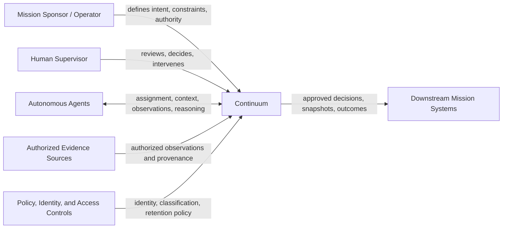

# Continuum System Context

## System purpose

Continuum is the system of record for the cognitive continuity of autonomous missions. It gathers attributable mission knowledge, coordinates agents within authority boundaries, and produces durable handoffs and lessons. It is not the external source of truth for every operational system; it preserves the mission-level interpretation and decisions made from those systems.

## Context diagram

## Actors and neighboring systems

| Actor/system                          | Relationship with Continuum                                                                         | Boundary rule                                                                                  |
| ------------------------------------- | --------------------------------------------------------------------------------------------------- | ---------------------------------------------------------------------------------------------- |
| Mission sponsor or operator           | Establishes intent, objectives, constraints, and accountable authority.                             | Remains accountable for authority delegated to a mission.                                      |
| Human supervisor                      | Reviews material risk, resolves escalations, and approves decisions where autonomy is insufficient. | Human intervention is represented as attributable domain activity.                             |
| Autonomous agent                      | Performs assigned work and contributes evidence, reasoning, proposals, and handoffs.                | Receives only authorized, curated context.                                                     |
| Authorized evidence source            | Supplies external facts, events, or documents used as observations.                                 | Continuum retains provenance and confidence; it does not claim ownership of source data.       |
| Policy, identity, and access controls | Determine who may act and which information may be inherited or disclosed.                          | Authorization is evaluated at action and handoff time, not just at mission creation.           |
| Downstream mission system             | Consumes approved outcomes or produces operational events relevant to the mission.                  | Continuum exports accountable outcomes; it must not obscure the source system's own authority. |

## System responsibilities

- Maintain a trustworthy chronology of mission knowledge and commitments.
- Construct role-sensitive context for multi-agent work and recovery.
- Preserve dissent, uncertainty, provenance, and decision rationale.
- Escalate and track hazards under mission-defined policy.
- Promote validated lessons into governed institutional knowledge.

## Explicit non-responsibilities

- Replacing source systems for identity, operational control, or authoritative external data.
- Treating generated reasoning as verified fact.
- Granting an agent authority merely because it can access context.
- Collapsing sensitive information boundaries for convenience during handoff.

## Quality attributes and implications

| Quality       | Architectural implication                                                                                 |
| ------------- | --------------------------------------------------------------------------------------------------------- |
| Traceability  | Preserve immutable artifact identity, source links, version lineage, and attributable actions.            |
| Availability  | Keep mission state recoverable from durable events and snapshots; make snapshot generation idempotent.    |
| Consistency   | Require strong transactional consistency for mission state, decision authority, and snapshot publication. |
| Scale         | Partition access and writes around mission identity; avoid cross-mission transactions in the normal path. |
| Security      | Apply classification and authorization to source artifacts, context curation, and snapshot projection.    |
| Extensibility | Add new agent types, evidence sources, and decision policies without changing core mission semantics.     |

## Data-platform direction

CockroachDB is a good fit for the authoritative relational core because mission work requires transactional state changes, global identifiers, serializable decision handling, and geographic resilience. The design should favor short, retry-safe transactions; mission-scoped write patterns; immutable artifacts; explicit versioning; and asynchronous projection for search, summaries, and agent-specific context. No database schema is defined by this document.
